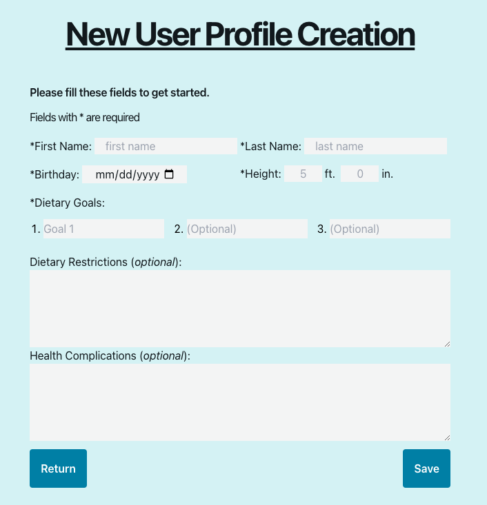
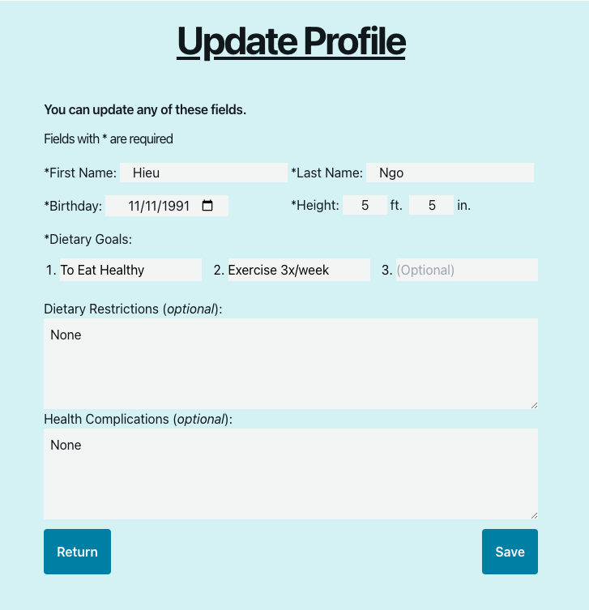
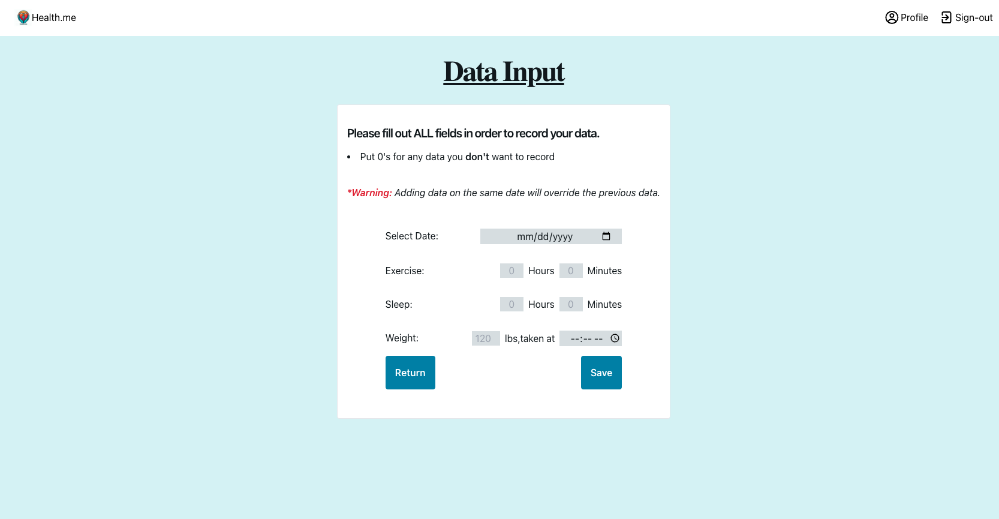
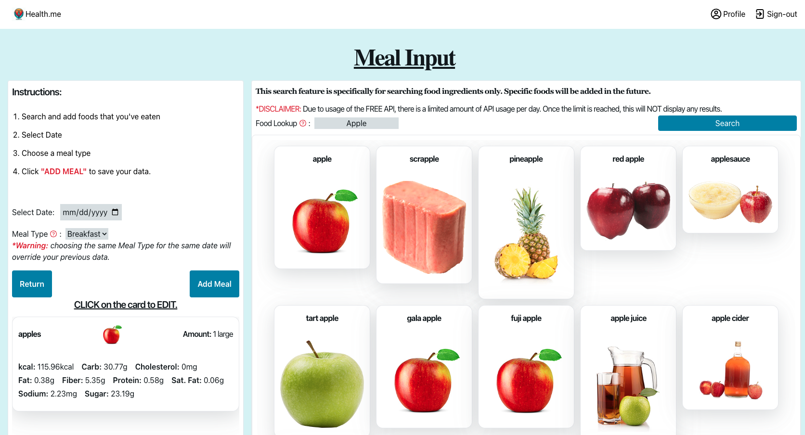
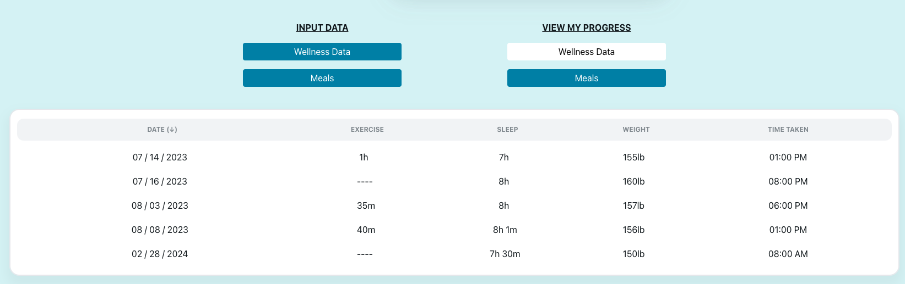
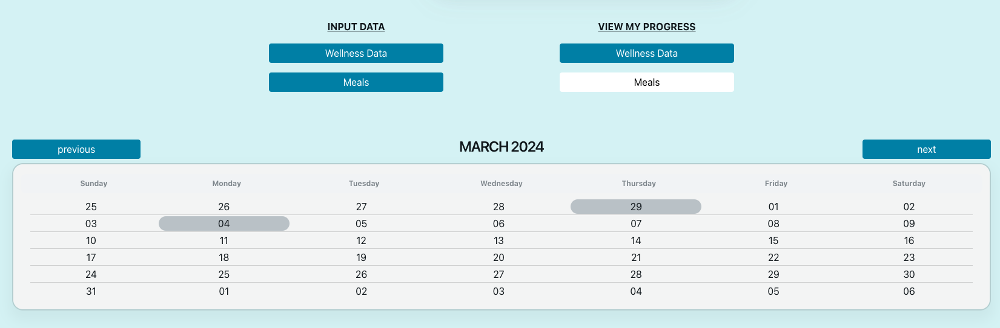
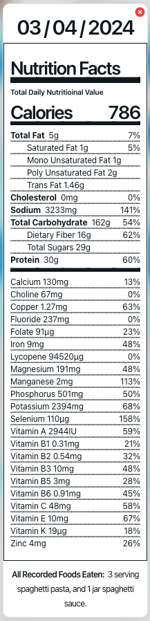

<h1 align="center">Health.me</h1>

By Hieu Ngo

## About the Project

> This web app allows users to record and track their health information, including sleep, exercise, weight, and meals.
> It also has:

1. Google Authorization for secure access to personal data.
2. Mobile Integration for phones and tablets.
3. Navigation Bar for quick access to different pages.

## Built with:

<!--  -->

## Supporting Dependencies:

### This project includes the following sections:

1. Homepage
2. Profile Page
3. Account Settings
4. Data Collection
5. Data Analysis
6. Mobile Integrations
7. Additional Features

## App Features

### Homepage:

<table>
  <tr>
    <td width="40%">
      
    </td>
    <td>
      The homepage offers a comprehensive overview of the program's functionalities and benefits to its users. To personalize their experience, users can conveniently sign in with their Google account via the top-right corner. Upon signing in, new users will need to create their profile. Returning users will automatically be redirected to their profile.
    </td>
  </tr>
</table>

(<a href="#top">back to top</a>)

### Profile Page:

<table>
  <tr>
    <td width="40%">
      
    </td>
    <td>
      The profile page contains a centralized hub for users to manage and access their data. The page features intuitive buttons for seamless data entry and navigation, allowing users to record new data and access existing records effortlessly. Additionally, users can edit their profile information conveniently using the settings button located at the top-right corner of their profile.
    </td>
  </tr>
</table>

(<a href="#top">back to top</a>)

### Account Settings:

<table>
  <tr>
    <td width="40%">
      
    </td>
    <td>
      <b>Create Profile:</b> New users must complete a profile creation form to initiate the ability to record and track their progress. This step ensures that users gain a thorough understanding of their health information and set achievable goals tailored to their needs throughout their journey with the application.
    </td>
  </tr>
  <tr>
    <td width="40%">
      
    </td>
    <td>
      <b>Update Profile:</b> Users can update their profile contents, allowing for comprehensive modifications to all aspects of their information. Every detail entered during the initial profile creation process is editable, empowering users with greater control over their personal data.
    </td>
  </tr>
</table>

(<a href="#top">back to top</a>)

### Data Collection:

<table>
  <tr>
    <td width="40%">
      
    </td>
    <td>
      <b>Health Data:</b> Users can record exercise, sleep, and weight data into their charts. The collected data is organized by date, enabling users to track their progress. Any changes to the data on a particular date will automatically update previous values, ensuring accurate and up-to-date records.
    </td>
  </tr>
  <tr>
    <td>
      
    </td>
    <td>
      <b>Food Data:</b> Users can search for food ingredients and integrate them into their health data. Users have the flexibility to add each food item to their meals using the extensive database of ingredients. Upon updating each food entry, users can conveniently view the nine fundamental nutritional values, empowering them to have an informed dietary understanding.
    </td>
  </tr>
</table>

(<a href="#top">back to top</a>)

### Data Analysis:

<table>
  <tr>
    <td width="40%">
      
    </td>
    <td>
      <b>Health Data:</b> Users can access their health records on the user page by clicking the "Wellness Data" button under the "VIEW MY PROGRESS" tab. This action prompts a table display showcasing sortable data that can be categorized by date, exercise, sleep, and weight, enhancing the accessibility and organization of their information.
    </td>
  </tr>
  <tr>
    <td>
      
    </td>
    <td>
      <b>Meals Data:</b> Users can access their meal records on the user page by clicking the "Meals" button under the "VIEW MY PROGRESS" tab. This action triggers a calendar view showcasing all dates that have meal data. Users can review comprehensive nutritional information by clicking on the specific date, including details on over 30 vitamins and nutrients, empowering them to track their dietary intake effectively.
    </td>
  </tr>
</table>

(<a href="#top">back to top</a>)

### Mobile Integration:

<table>
  <tr>
    <td width="33%">
      
    </td>
    <td width="33%">
      
    </td>
    <td width="33%">
      
    </td>
  </tr>
  <tr>
    <td width="33%">
      
    </td>
    <td width="33%">
      
    </td>
    <td width="33%">
      
    </td>
  </tr>
</table>

(<a href="#top">back to top</a>)

### Additional Features:

<table>
  <tr>
    <td width="40%">
      
    </td>
    <td>
      <b>Nutrition Facts:</b> The nutrition facts modal displays a comprehensive summary of all foods recorded on a specific day, encompassing detailed nutritional information on over 30 key components. Additionally, it provides a list of the foods consumed, offering users a thorough overview of their dietary intake for that day.
    </td>
  </tr>
  <tr>
    <td width="40%">
      
    </td>
    <td>
      <b>Footer:</b> The footer section includes essential copyright information and different links typically found on a webpage. Under the 'Social' tab, the LinkedIn and GitHub links will redirect users to my profile, while Facebook and Twitter will redirect to the media websites.
    </td>
  </tr>
</table>

(<a href="#top">back to top</a>)

# Thank you for viewing my repo!

### Please reach out to me if you find any issues using the site.
